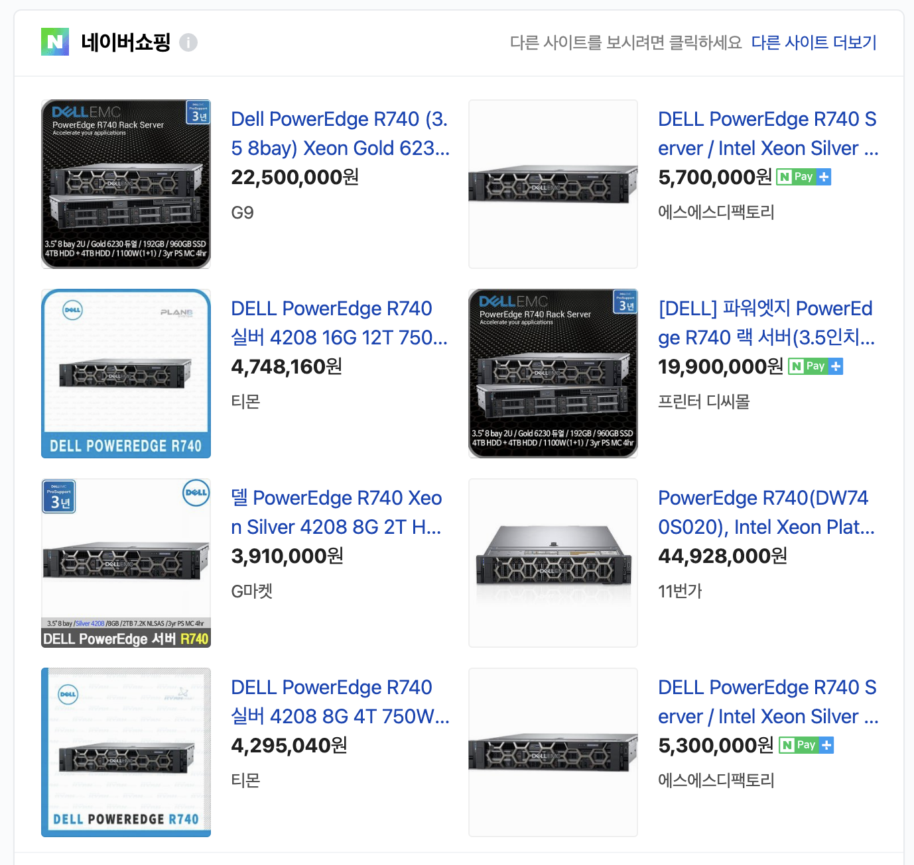

# 제 2장 : 서버를 열어보자

## 2.1 물리 서버

* 설치 장소?
  * 서버의 열기를 식히기 위해 낮은 실내 온도, 빛 X

* 랙에 서버가 어떻게 딱 맞지?
  * 서버 랙에도 규격이 있음
  * NHN 사옥 근처에 있는 데이터센터(플레이허브)
    * 

* 책에서 주로 설명하는 예시 서버 : 델 EMC PowerEdge R740 (PowerEdge 740)
  * 
* 26p 그림 2.6 참고하여 대략적으로 어떻게 연결되어있는지 보기
  * 상세한 설명은 CPU, 메모리, HDD, 네트워크 인터페이스, 버스

## 2.2 CPU

서버 중심에 위치해서 연산 처리를 실시

* 표면 : 발열이 심해서 보통 냉각기가 설치되어있음
* 뒷면 : 버스 연결로 메모리, 디스크와 데이터 교환

* 기억장치(메모리), 입출력 장치를 통해 전달된 명령과 데이터를 받아 연산을 처리하고 결과 반환
  * 키보드, 마우스를 통한 Interrupt는 5장에서!

## 2.3 메모리
* CPU에 전달하는 내용이나 데이터를 저장하거나 처리 결과를 받음
* 영구성이 없음
* 물리적인 모터 구통 X, 전기적 처리
* 메모리 액세스가 매우 빠름
* CPU 자체 메모리? 캐시는 5장에서!

## 2.4 I/O 장치
### 하드 디스크 드라이브(HDD)
* 장기 저장 목적의 데이터 저장 장소
* 자기 원반이 회전하며 읽기/쓰기를 처리 => 물리 법칙에 좌우됨
* 요즘은 기술이 발달해서 SSD! (물리적인 회전 요소를 사용하지 않는 디스크)
* CPU 캐시 이용 방법과 동일한 캐시 개념을 가짐 (5장에서!)

### 네트워크 인터페이스
* 서버와 외부 장비를 연결하기 위한 외부 접속용 인터페이스
* LAN

...
### 서버에 대해 더 자세히 알고 싶어졌나요?
그렇다면 조립 PC를 추천합니다(저자 왈)

## 2.5 버스
서버 내부에 있는 컴포넌트들을 서로 연결시키는 회선

* 대역?
  * 데이터 전송 능력 = 한번에 데이터를 보낼 수 있는 데이터의 폭(전송 폭) * 1초에 전송할 수 있는 횟수(전송 횟수)
  * 성능에 대해 다루는 8장에서!

## 2장 요약 : 컴잘알의 노예비유법

### 써먹어서 컴잘알이 되어 보자!

감사합니다 :-)