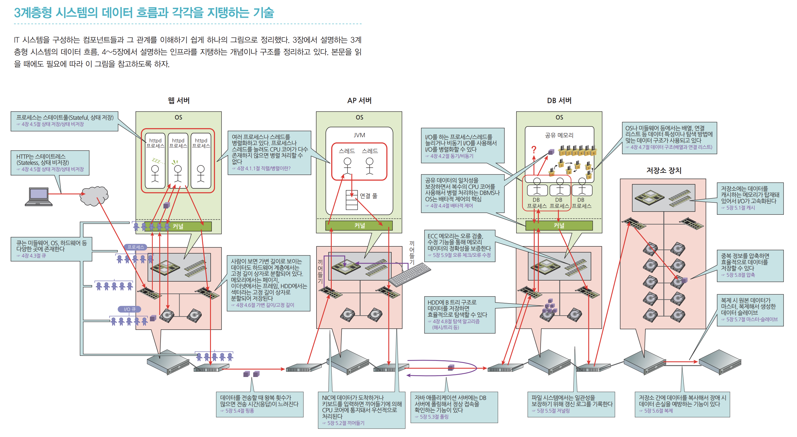
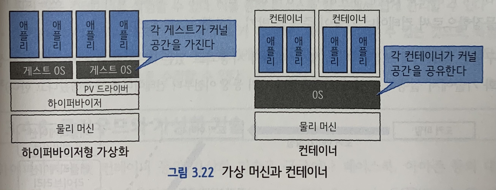
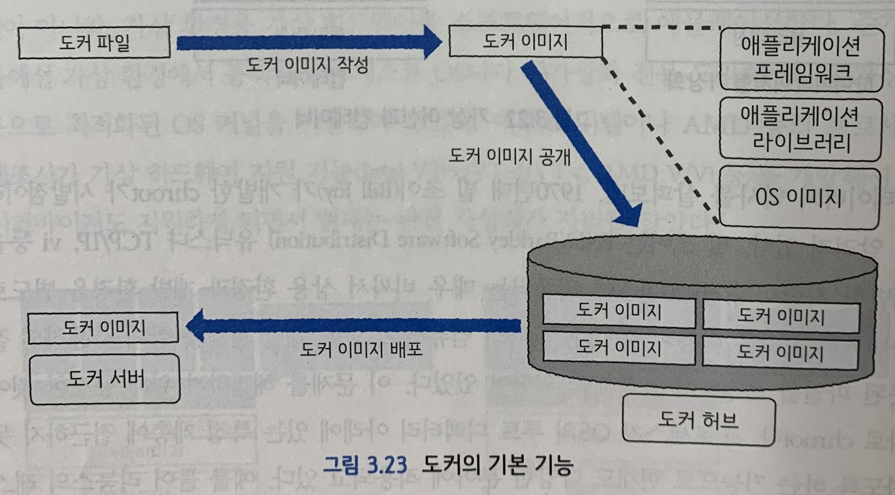

# 제 3장 : 3계층형 시스템을 살펴보자

---

## 3.1 구성도

---

웹서버 - AP서버 - DB서버

## 3.2 주요 개념

---

### 3.2.1 프로세스와 스레드

|      | 프로세스                | 스레드                                                       |
| ---- | ----------------------- | ------------------------------------------------------------ |
| 장점 | 개별 처리 독립성이 높다 | 생성 시 부하가 낮다                                          |
| 단점 | 생성 시 CPU 부하가 높다 | 메모리 공간을 공유하기 때문에 의도하지 않는 데이터 읽기/쓰기가 발생할 수 있다 |

### 3.2.2 OS 커널

OS의 본질

뒤에서 무슨 일이 벌어지는지 은폐하면서도 편리한 인터페이스를 제공한다.

**역할**

1. **시스템 콜 인터페이스**: 프로세스/스레드에서 커널로 연결되는 인터페이스, 키보드나 마우스 입력은 끼어들기로 처리
2. **프로세스 관리**: CPU 코어 관리. 우선순위 스케줄링
3. **메모리 관리**: 물리 메모리 공간 관리
4. **네트워크 스택**: 6장에서~
5. **파일 시스템 관리**: 파일 시스템용 인터페이스 제공. 파일 시스템은 여러 프로세스가 공유
6. **장치 드라이버**: 디스크나 NIC 등의 물리 장치용 인터페이스 제공

**Monolithic vs Micro**

유닉스, 리눅스 vs 맥

양쪽의 장점을 섞어쓴다.

## 3.2 웹 데이터 흐름

웹 데이터 흐름의 본질은 '요청 기반으로 어떠한 처리를 하고 필요에 따라 해당 요청을 삼자에게 할당하는 것'이다.

 

### 3.3.1 클라이언트 PC부터 웹 서버까지

1. 웹 브라우저가 요청을 보낸다.
2. 이름 해석 후 해당 웹 서버에 요청을 보낸다.
3. 웹 서버가 요청을 접수한다.
4. 웹 서버가 정적 콘텐츠인지 동적 콘텐츠인지 판단한다.
5. 정적 - 디스크에서 직접 읽기 / 동적 - AP 서버에 요청을 보낸다.

 

### 3.3.2 웹 서버부터 AP 서버까지

1. 웹 서버로부터 요청이 도착한다.
2. 스레드가 요청을 받으면 자신이 계산할 수 있는지, 아니면 DB 접속이 필요한지를 판단한다.
3. DB 접속이 필요하면 connection pool에 액세스한다.
4. DB 서버에 요청을 보낸다.

 

### 3.3.3 AP 서버부터 DB 서버까지

1. AP 서버로부터 요청이 도착한다.
2. 프로세스가 요청을 접수하고 캐시가 존재하는지 확인한다.
3. 캐시에 없으면 디스크에 액세스한다.
4. 디스크가 데이터를 반환한다.
5. 데이터를 캐시 형태로 저장한다.
6. 결과를 AP 서버에 반환한다.

\* RDBMS 비켜!????

 

### 3.3.4 AP 서버부터 웹 서버까지

1. DB 서버로부터 데이터가 도착한다.
2. 스레드가 데이터를 가지고 계산 등을 한 후에 파일 데이터를 생성한다.
3. 결과를 웹 서버로 반환한다.

 

### 3.3.5 웹 서버부터 클라이언트 PC까지

1. AP 서버로부터 데이터가 도착한다.
2. 프로세스는 받은 데이터를 그대로 반환한다.
3. 결과가 웹 브라우저로 반환되고 화면에 표시된다.

### 3.3.6 정리

**공통점**

1. 요청을 받는다.
2. 요청을 파악해서 별도 서버로 요청을 보내거나,
3. 응답한다.

**요청 기반 아키텍처**

- 각 서버는 문을 열고 기다리는 상태
- 어느정도 요청이 올지는 실제 요청이오기 전까지는 알 수 없다.
- 성능 문제가 발생하는 이유 중 하나!

## 3.4 가상화

---

###3.4.1 가상화란?

물리 리소스를 추상화하는 것

### 3.4.2 OS도 가상화 기술의 하나

하드웨어를 의식하지 않고 애플리케이션을 실행

OS의 커널에 의해 하드웨어 추상화

### 3.4.3 가상 머신

호스트 OS vs 하이퍼바이저

| 호스트 OS                             | 하이퍼바이저                                |
| ------------------------------------- | ------------------------------------------- |
| 호스트 OS 상에 가상화 소프트웨어 설치 | 하드웨어 상에서 직접 가상화 소프트웨어 실행 |
| 성능 제한                             | 성능 우수. 서버 가상화의 대표 기술          |

완전가상화 vs 준가상화

| 완전가상화                      | 준가상화                                     |
| ------------------------------- | -------------------------------------------- |
| 일반적인 OS, 드라이버 이용 가능 | 가상환경용 가상 하드웨어를 에뮬레이션        |
| 성능 저하                       | 준가상화 전용 드라이버, OS 커널을 사용해야함 |

프로세서 제조사가 하이퍼바이저를 지원. 완전 가상화 win

### 3.4.4 컨테이너의 역사

**컨테이너란?** 

리소스가 격리된 프로세스

하나의 OS 상에서 여러 개를 동시에 가동할 수 있다.

각각 독립된 루트파일시스템, CPU/메모리, 프로세스 공간 등을 사용할 수 있다.

컨테이너의 아버지 Bill Joy

**chroot**

프로세스가 OS의 루트 디렉터리 아래에 있는 특정 계층에 접근하지 못하도록 하는 기능

\+ 특정 디렉터리 이하를 루트 디렉터리처럼 보이게 하는 기능

### 3.4.5 도커의 등장

파일 시스템 이미지의 패키징과 버저닝

컨테이너 이미지 공유

클라우드에 애플리케이션 배포 시 프레임워크나 라이브러리 등의 버전이 일치하지 않아서 생기는 문제를 해결!

**도커의 장점**

- 컨테이너는 호스트 OS와 OS 커널을 공유
  - 컨테이너 실행, 정지 속도가 빠르다
  - 한대의 호스트 머신상에 훨씬 많은 컨테이너를 실행
  - 리소스를 한 곳에서 쉽게 관리
- 라이브러리나 프레임워크 등을 도커 이미지로 묶어서 공유
  - 개발 환경에서 재현되지 않는 문제가 발생하기 어렵다.
  - 버그 수정 용이

### 3.4.6 클라우드와 가상화 기술

AWS, GCP, Azure

[쿠버네티스가 도커를 버렸다?](https://kubernetes.io/ko/blog/2020/12/02/dont-panic-kubernetes-and-docker/)

[우리가 클라우드를 싫어하는 11가지 이유](https://www.ciokorea.com/news/177989)

[쿠버네티스에서 쉽게 저지르는 10가지 실수](https://coffeewhale.com/kubernetes/mistake/2020/11/29/mistake-10/)

