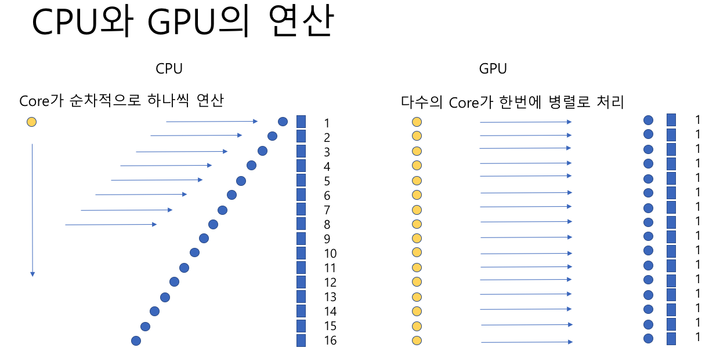

# **4. 인프라를 지탱하는 기본 이론**

## **4.1. 직렬/병렬**
### **4.1.1 직렬/병렬이란?**
- 최근 추세는 클럭 속도 향상보다 코어 수를 늘리는 방향으로 발전
- 무조건 병렬화 한다고 해서 성능이 향상되는 것은아니다. 병렬화환 하드웨어를 놀리지 않고 어떻게 효율적으로활용하는지가 중요
- 책에서는 직렬은 1차선, 병렬은 다차선 도로라고 설명하고 있다.
- 차선이 줄어드는 부분, 즉 **병목 현상**을 해결하는 방법이 중요하다.
- 또한 병렬화를 통해 진행한 일을 한곳에 모을때도 **오버헤드**가 발생한다.
> cpu와 gpu 연산 방법
> 

- 직렬 처리 속도를 올리는 것에는 한계가 있다.
- 병렬화를 통해 속도가 올라간다기 보다는 단위 시간당 처리량이 올라간다.

### **4.1.2 어디에 사용 되나?**
**웹 서버와 AP 서버에서의 병렬화**
- 웹서버 에서는 다수의 이용자가 접속하기 때문에 복수의 프로세스가 분담해서 병렬 처리를 함
- Apache HTTP Server 에서는 멀티 프로세스(아파치 - prefork), 멀티 쓰레드 + 프로세스 를 섞어쓰는 모델 (아파치 - worker) 등이 있다.
> **여기서 우리는 멀티 프로세스 기반의 서버 / 멀티 쓰레드 기반의 서버 / 멀티 플렉싱 기반의 서버에 대한 이해가 필요하다.**
> - 멀티프로세스 기반 서버 : 다수의 프로세스를 생성하는 방식으로 서비스를 제공한다.
> - 멀티스레드 기반 서버 : 클라이언트의 수만큼 스레드를 생성하는 방식으로 서비스를 제공한다.
> - 멀티플렉싱 기반 서버 : 입출력 대상을 묶어서 관리하는 방식으로 서비스를 제공한다.
> https://jongmin92.github.io/2019/02/28/Java/java-with-non-blocking-io/
- 스레드를 무작정 늘리는 것은 옳지 않다. 특정 시점에 코어를 사용할 수 있는 것은 쓰레드 하나 밖에 없다.
- 일꾼이 아무리 많아도 일할 수 있는 도구가 없다면 소용없다.

**DB 서버에서의 병렬화**
- 오라클에서는 접속 수 만큼 프로세스가 생성된다.
- 또한 쓰기 작업시 병목이 발생하면 해당 작업을 하는 프로세스를 늘리는 방법이 있고, 비동기 I/O를 사용해서 OS측에 쓰기 처리를 병렬화 하는 방법도 있다.

### **4.1.3 정리**
- 병렬화 에서는 직렬 처리 성능이 향상되지는 않지만, 단위 시간당 처리량을 늘릴 수 있다.
- 합류점, 직렬화 구간, 분기점에서 병목이 발생한다.
- 최대 처리량의 기준은 처리 구간 중에서 가장 처리량이 낮은 구간이다.

> 동시성과 병렬성
> - 동시성은 싱글 코어에서 멀티 스레드를 동작시키는 방법
> - 병렬성은 멀티 코어에서 멀티 프로세스(스레드)를 동작 시키는 방법

## **4.2 동기/비동기**

### **4.2.1 동기/비동기란?**
- 누군가에게 일을 부탁하고 그 일이 끝나기까지 완료 여부를 기다리는 것이 동기 **(Blocking 아니야?)**
- 일을 부탁하고 '끝나면 말해(callback)' 라고 신경쓰지 않는것이 비동기
  
> https://homoefficio.github.io/2017/02/19/Blocking-NonBlocking-Synchronous-Asynchronous/
> - **Blocking/NonBlocking은 호출되는 함수가 바로 리턴하느냐 마느냐가 관심사**
>   - 바로 리턴하지 않으면 Blocking
>   - 바로 리턴하면 NonBlocking
> - **Synchronous/Asynchronous는 호출되는 함수의 작업 완료 여부를 누가 신경쓰냐가 관심사**
>   - 호출되는 함수의 작업 완료를 호출한 함수가 신경쓰면 Synchronous
>   - 호출되는 함수의 작업 완료를 호출된 함수가 신경쓰면 Asynchronous

### **4.2.2 어디에 사용되나?**
- Ajax 통신 (검색어 자동 완성을 예로 들고 있음)
- DBMS에서 쓰기 I/O 를 비동기로 실행 가능
  - 공유 메모리 내용을 HDD에 쓰는 과정에서 커널에 쓰기 의뢰 후 기다리지 않고 다음 쓰기 의뢰를 한다.

### **4.2.3 정리**
- 비동기로 요구한 처리가 끝나지 않은 상태에서 처리해도 다음 처리가 문제가 없을지 고려해야 한다.
- 비동기로 요구한 처리의 종료를 확인하는 방법에 대한 고려
  
> c10k 문제
> - 1만 클라이언트가 동시 접속하는 것을 버틸 수 있을까?
> - 이 문제 때문에 nginx가 처음 발표

## **4.3 큐**

### **4.3.1 큐란?**
- FIFO : First In, First Out / 先入先出
- 성능 튜닝, 메시지 큐, OS 등등 엄청나게 많은 곳에 쓰이고 있다.
- 대기 행렬은 끝부터 시작, 처리는 머리부터~!

### **4.3.2 어디에 사용되나?**
- CPU 처리를 기다리고 있는 프로세스나 스레드 행렬, 하드 디스크 등의 저장소 읽기 처리를 기다리고 있는 I/O 요구 행렬, 네트워크 접속 성립을 기다리고 있는 접속 요구 행렬 등등
- CPU 를 기다리고 있는 프로세스 행렬을 '런큐(Run-queue)' 라고 한다.
> mac os 에서는 vm_stat
> mac os 에서 커널 I/O의 통계를 보는 명령어 : iostat

**데이터베이스의 디스크 I/O**
- 데이터를 기록하는 DBWR, REDO LOG를 기록하는 LGWR 은 각각 다른 HDD에 쓰기를 요청해야 한다. 그렇기 때문에 각각 다른 QUEUE에 쓰기 요청을 한다.
- 프로세스나 스레드가 작업을 요청하는 대상이 CPU가 아닌 HDD 인 점만 다르다.

### **4.3.3 정리**
- 데이터베이스의 성능 문제와 관련해서는 데이터베이스 큐, OS 런큐, I/O 요청 큐 등을 확인하면 처리 지연이 발생하고 있는지 확인할 수 있다.
- 데이터 생산자와 소비자 입장에서도 큐(버퍼, 메시지 등등)를 활용한 작업이 많다.
  

## **4.4 배타적 제어**

### **4.4.1 배타적 제어란?**
- 공유하는 것에 대해서 사용중일 경우 다른 곳에서 접근 못하게 하는것이 배타적 제어
- 대부분 병렬 처리시에 필요하다.
- 또한 배타적 제어를 하는 부분에서 병목 현상이 발생하기 쉽다.
- OS, DBMS등 공유 데이터를 통해 병렬 작업을 하는 많은 곳에서 다양한 방식에 배타적 제어 컨셉을 사용하고 있다.
- 특징
  - 공유자원에 동시에 엑세스(대부분 갱신)하면 불일치로 인한 문제가 발생할 수 있다.
  - 지정된 처리만 공유 자원에 접근하게 해서 불일치가 발생하지 않도록 해야 한다.
  - 병목 현상이 발생할 수 있다.

### **4.4.2 어디에 사용되나?**
**DBMS에 사용되는 배타적 제어**
- DBMS에서 사용하는 배타적 제어 방법중 래치 또는 스핀락이라 불리는 아주 짧은 시간을 대기하는 방법이 있다.
  - 스핀락에 경우 빠르게 공유 자원에 접근 못할 경우 성능에 좋지않은 영향을 끼친다.
  - 컨텍스트 스위칭에 들어가는 리소스(시간)보다 대기에 필요한 리소스가 더 많이 들어갈 경우 리소스 낭비로 이어진다.
- 또한 계속해서 스핀락을 유지할지 아니면 슬립에 들어갈지 판단하는 adaptive lock 도 있다

> 뮤텍스, 세마포어 공부?!

**OS 커널에 사용되는 베타적 제어**
- 한번에 하나의 스레드만 커널 모드에서 동작하기 위해 사용되었다.
- 2011년 리눅스 커널 2.6.39 에서 최종적으로 삭제
  
### **4.4.3 정리**
- 배타적 제어를 사용하면 공유 데이터의 일관성은 지킬 수 있다.
- 다만 병렬처리가 어렵고 병목 현상이 발생할 수 있다.

> **멀티 프로세서에서는 배타적 제어가 어렵다**
> - 자바 에서는 Atomic 타입에서 사용하는 CAS(Compare And Swap) 방식을 사용한다.
> - 각각의 멀티 프로세서 캐시에서 가지고 있는 데이터 값을 참조하는것이 아니라 메모리에 있는 값을 참고한다.

### **4.5 상태 저장/상태 비저장**